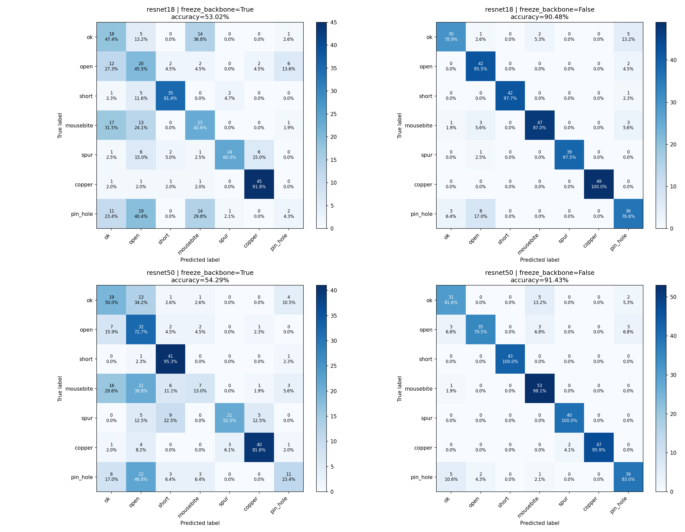
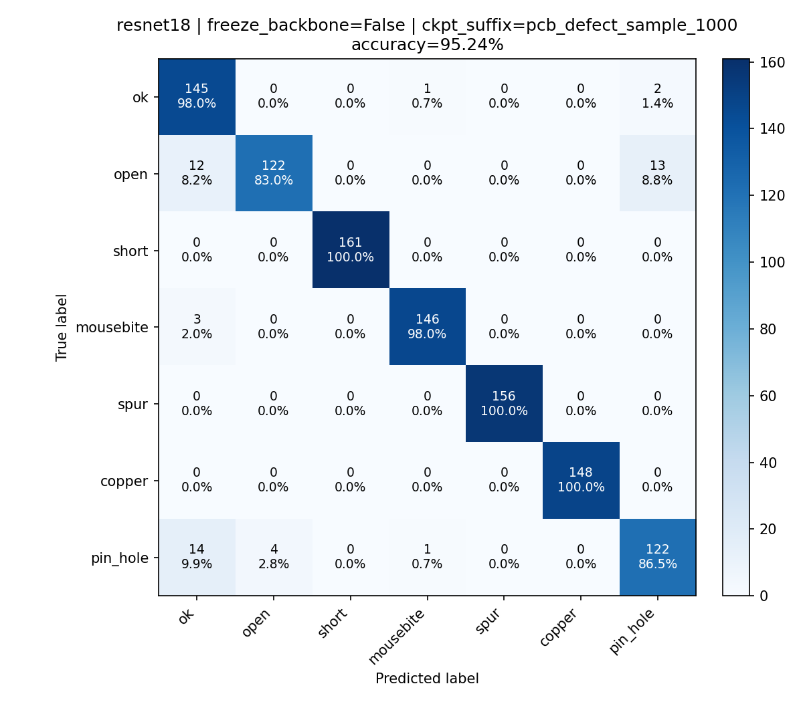

# Verdict — Recommandation TechniMatic via Mistral
> 8 lignes maximum.
> Auteurs : `Julien D` × `Célia F` — Date : `19-08-2026`

**Recommandation** : Option B — transfer learning avec ResNet-18 pré-entraîné.

**Raison principale (chiffrée)** : le problème est très spécifique et les différences entre les défauts sont fines

    - Le pré-entraînement ImageNet de ResNet-18 fournit une base de représentations plus pertinente pour viser 90 % de précision

    - Dans le notebook, l'option B atteint 0,568 d'accuracy sur le holdout, avec 44,5 ms d'inférence par image et un modèle de 44,8 Mo

    - En libérant les couches pour un réapprentissage il est possible d'atteindre 90% de précision avec ResNet18, 91% avec ResNet50 ce qui constitue un gain marginal par rapport à l'augmentation de taille du modèle

    - Augmenter la base d'apprentissage à 1000 images par classe a permis d'atteindre 95% de précision avec 2% de fausse alerte et au maximum 10% de recall sur les problèmes rencontrés

    - La version B est plus coûteuse que l'option A en temps et en mémoire (0,606, 2,1 ms et 2,2 Mo), mais reste un compromis raisonnable pour gagner en capacité de généralisation. Le temps passé à optimiser l'architecture du modèle de l'option A pour atteindre les performances de l'option B sera prohibitif

    - Il pourra être intéressant d'utiliser une analyse en vision traditionnelle complémentaire pour valider les résultats pour certaines classes très proches (EtudeVision.ipynb)

**Condition de changement d'avis** : s'il y a peu de puissance de calcul et que la latence d'inférence doit être courte, l'option A pourrait être reconsidérée ; CLIP pourrait devenir compétitif s'il acceptait directement une image plutôt qu'un prompt textuel. Les images analysées et leur contexte semblent trop éloignées des images utilisées pour l'entraînement des modèles de fondation actuels.

---
*Verdict binôme — `Julien D` × `Célia F`, 19-08-2026.*
